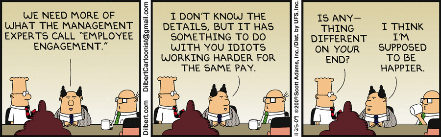
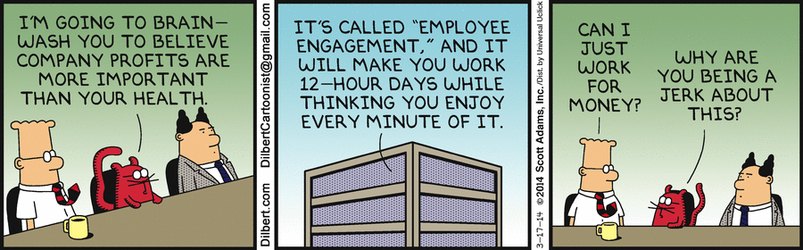
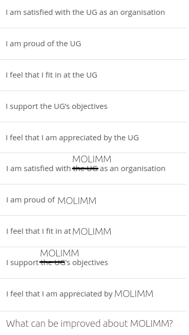
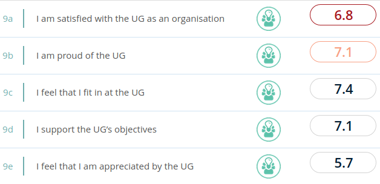

# molimm_employee_engagement_plan

Survey to measure MOLIMM employee engagement.

## Timeline

Date                           |Goal
-------------------------------|------------------------------------------------------------------------------------
Tuesday 2020-11-17 17:00-17:30 | :heavy_check_mark: Meeting to decide on a timeline
Tuesday 2020-11-24 17:00-17:30 | :heavy_check_mark: Finish proposal survey questions
Friday  2020-11-27 16:00-17:00 | :white_check_mark: Informally ask group to add/modify on survey questions, before Sunday Dec 6th
Monday  2020-11-30 10:00-11:00 |Formally ask group to add/modify survey questions, before Sunday Dec 6th
Monday  2020-12-07 10:00-11:00 |Final version of survey, send to PI for approval, before Thursday Dec 10th 23:59
Friday  2020-12-11 16:00-17:00 |Post official survey online, announce by email, announce informally
Monday  2020-12-14 10:00-11:00 |Announce formally to fill in survey, before Sunday Dec 20th 23:59
Monday  2020-12-21  8:00-9:00  |Put results online
Monday  2020-12-21 10:00-11:00 |Share results with group

## Survey

## Survey in plain-text

Questions are:

 * I am satisfied with the UG as an organisation
 * I am proud of the UG
 * I feel that I fit at the UG
 * I support the UG's objectives
 * I feel that I am appreciated by the UG
 * I am satisfied with MOLIMM as an organisation
 * I am proud of MOLIMM
 * I feel that I fit at MOLIMM
 * I support MOLIMM's objectives
 * I feel that I am appreciated by MOLIMM
 * What can be improved about MOLIMM?

## Older notes

### Bigger context

Employee engagement is reportedly low.
High employee engagement is an important factor for employee well-being
and productivity.

Here are the results of the 2019 survey:

Note that I've edited the picture to only show
RuG results, raw image can be found [here](results_2019.png), 
full survey in the 'results' folder or [this PDF](results_2019.pfd).
The columns are: GELIFES, Previous survey, FSE, Benchmark universities,
Rijksuniversiteit Groningen.

### Informally done right already

 * PI always ask employee's for compliments, complaints, feedback 
   at the end of every meeting
 * PI's office is always open for employees to walk in
 * PI listens to employees, 
   employees are observably influential in the group weekly schedule

### Informally overlooked things

 * Thinking 'I (the PI) do a great job already' may 
   not be shared by the employees
 * The employees may feel engaged with the group, 
   but not with the university

### Opportunities

 * Measure the employee engagement, separated by level, i.e. MOLIMM and RuG. 
 * Prove that MOLIMM does an awesome job, by doing an anonymous survey,
   held among and organized by the postdocs/PhDs. Do this every half year.
   Publish the results om a website, regardless of the findings. Prove that
   there is improvement or a stable high level to the group. 
   Show that plot as well! Seperarate this for MOLIMM and Rug

Example:

 * [Raw results](https://github.com/djog/dojo/blob/master/Evaluaties/20200625/Resultaten.md)
 * [Plot](https://github.com/djog/dojo/blob/master/Evaluaties/Evaluaties_scatter.png)

